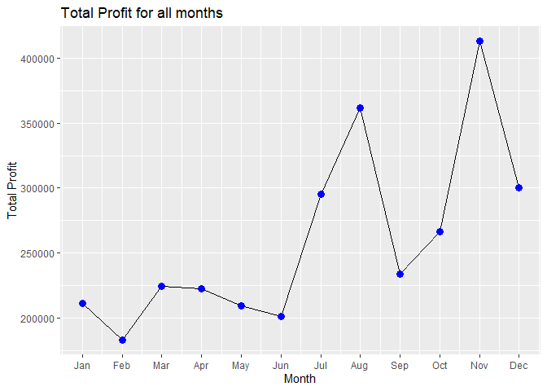
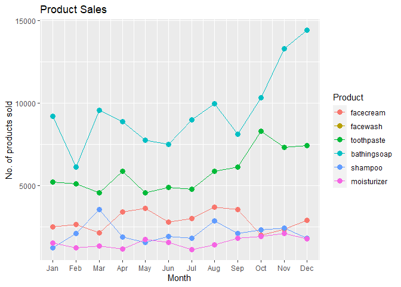
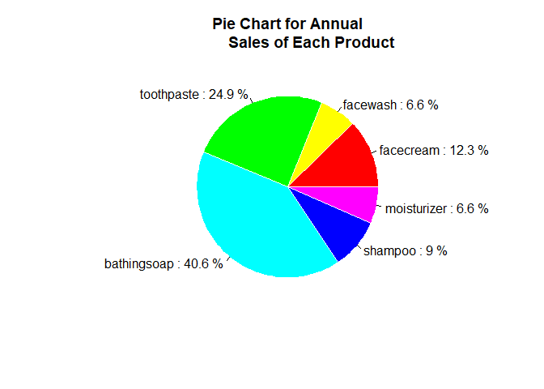

DataByte Inductions Task 1: Company Sales
================

``` r
library(ggplot2)

sales <- read.csv("company_sales_data - company_sales_data.csv")
sales_df <- data.frame(sales)

g <- ggplot(data = sales_df, aes(x = month_number, y = total_profit))
plt <- g + geom_line() +geom_point(color = "blue", size = 3) +
    scale_x_continuous(breaks = sales_df$month_number, labels = month.abb) +
    labs(x = "Month", y = "Total Profit", title = "Total Profit for all months")
    
print(plt)  
```

<!-- -->

``` r
library(reshape2)

temp_data <- melt(sales_df[,1:7], id = "month_number")
colnames(temp_data)[2:3] <- c("Product", "Units_Sold")
g2 <- ggplot(temp_data, aes(month_number,Units_Sold, colour = Product))
plt2 <- g2 + geom_line() +
    geom_point(size = 3)+
    scale_x_continuous(breaks = sales_df$month_number, labels = month.abb) +
    labs(x = "Month", y = "No. of products sold", title = "Product Sales")

print(plt2)
```

<!-- -->

``` r
annual_sales <- data.frame(Product = names(sales_df[,2:7]), 
                 Total_Sales= unname(colSums(sales_df[,2:7])))
p <- annual_sales$Total_Sales*100/sum(annual_sales$Total_Sales)
labelsf <- paste(annual_sales$Product,":", round(p,1),"%", sep = " ")
plt3 <- pie(annual_sales$Total_Sales,labels = labelsf, main = "Pie Chart for Annual
            Sales of Each Product", border = "white",
            col = rainbow(length(annual_sales[,2])))
```

<!-- -->

``` r
print(plt3)
```

    ## NULL
